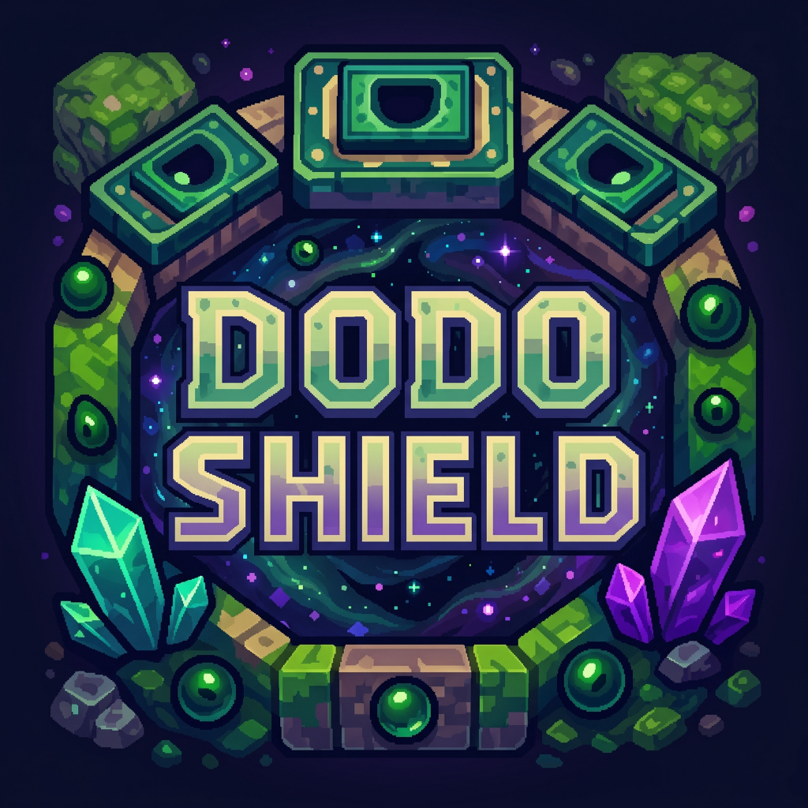

<p align="center"></p>

<h1 align="center">DodoShield Launcher</h1>

<p align="center">Лаунчер Minecraft для мережі серверів <a href="https://dodoshield.com">DodoShield</a>. Сам ставить Java, Forge/Fabric і всі моди обраної збірки та тримає їх актуальними — гравець лише натискає «Грати».</p>

<p align="center">
  <a href="https://launcher.dodoshield.com/updates/DodoShield-Launcher-setup.exe"><b>⬇ Завантажити для Windows</b></a>
  ·
  <a href="https://dodoshield.com">Сайт</a>
</p>

---

## Що вміє

- **Кілька збірок в одному лаунчері** — Immortal 3.1.1 (Forge 1.20.1, 250+ модів) та Dodoshield SMP (Fabric, Minecraft 26.2); перемикаються вкладкою зверху, нові з'являються самі.
- **Все автоматично** — потрібна Java (17 / 25), модлоадер, моди, конфіги, ресурспаки. Файли звіряються за хешами, тож поламати збірку випадковим кліком неможливо.
- **Обов'язкове оновлення** — при запуску лаунчер перевіряє оновлення і не показує головний екран, поки не стане актуальним; у відкритому лаунчері нову версію помічає за ~30 с і показує кнопку «Оновити».
- **Налаштування збірки** — Immortal приходить із готовими клавішами, FOV, ресурспаками й шейдерами; Dodoshield SMP лишає все за замовчуванням. Сервер збірки завжди є у списку серверів гри, навіть якщо його звідти прибрали.
- **Вхід через акаунт Microsoft** — у системному браузері (з запасним вбудованим вікном), паролі не зберігаються.
- **Дрібниці** — інтерфейс українською, статус сервера й онлайн на головному екрані, один екземпляр лаунчера, блокування «Грати», поки гра запущена.

## Як зібрано

Це форк [Helios Launcher](https://github.com/dscalzi/HeliosLauncher) (Electron), дистрибутив збірок генерується [Nebula](https://github.com/dscalzi/Nebula) і роздається з `launcher.dodoshield.com`. Оригінальний README Helios — у [docs/HELIOS_README.md](docs/HELIOS_README.md).

Основні відмінності від Helios у цьому репозиторії:

| Файл | Що змінено |
| --- | --- |
| `app/assets/js/scripts/uicore.js` | обов'язковий «гейт» оновлення при старті, кнопка/діалог оновлення у відкритому лаунчері |
| `index.js` | вхід через системний браузер (loopback `http://localhost`), single-instance, відстеження `latest.yml` за ETag |
| `app/assets/js/authmanager.js` | два Azure client id (браузерний + вбудований) з автоматичним відкатом |
| `app/assets/js/processbuilder.js` | підтримка нового шляху нативних бібліотек Minecraft 26.x (`natives/java`) |
| `app/assets/js/serverstatus.js` | власний пінг сервера без ліміту на розмір відповіді (Forge-сервери з сотнями модів) |
| `app/assets/js/scripts/landing.js` | вкладки збірок, одноразове застосування дефолтних конфігів, `game-output.log` |
| `app/assets/lang/uk_UA.toml` | повний український переклад |

## Збірка з вихідників

```bash
npm install
npm start          # запуск у режимі розробки
npm run dist:win   # інсталятор для Windows (dist/)
```

Потрібен Node.js 22+. Адреса дистрибутиву задається в `app/assets/js/distromanager.js`, оновлень — в `electron-builder.yml`.

## Як допомогти

Правки й ідеї вітаються — це звичайний форк Helios, тут немає нічого секретного.

1. Зробіть форк, гілку від `main` і Pull Request; в описі — що змінилось і як це перевірити.
2. Перед PR: `npm run lint` і запуск `npm start` (лаунчер має відкритись і показати збірки).
3. Знайшли баг або маєте пропозицію — заводьте [issue](https://github.com/Sebastian-xD/DodoShield-Launcher/issues) з версією лаунчера та, якщо є, логом із «Налаштування → Про програму».

Хочете підняти власну мережу на цьому лаунчері: свій список збірок генерується [Nebula](https://github.com/dscalzi/Nebula), після чого достатньо замінити адресу дистрибутиву в `app/assets/js/distromanager.js`, адресу оновлень в `electron-builder.yml` та іконки в `app/assets/images/`. Azure client id для входу Microsoft — власний, у `app/assets/js/ipcconstants.js`.

## Ліцензія

MIT — як і Helios Launcher, © Daniel D. Scalzi та учасники DodoShield. Див. [LICENSE.txt](LICENSE.txt).

Minecraft є торговою маркою Mojang AB. Проєкт не пов'язаний із Mojang/Microsoft.
